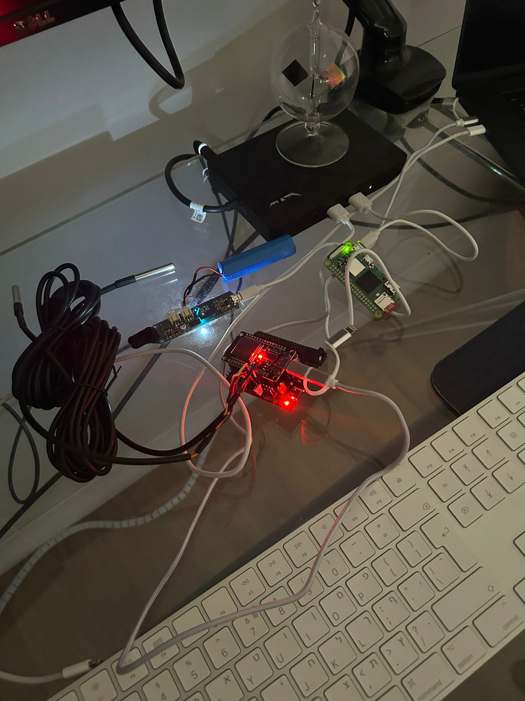

<h3 align="center" style="font-family: 'Fira Mono', Monospace;">esp32-pi-solar-control</h3>
<p align="center">
    
</p>

<h3 align="center" style="font-family: 'Fira Mono', Monospace;">ESP32/PiZero-powered solar valve control system</h3>

## Project Overview

esp32-pi-solar-control intelligently controls a water valve based on temperature readings from a solar water heating system. Its primary goal is to prevent energy loss by:
* Measuring the temperature of both:
    * The solar collector pipe (coming from the rooftop)
    * The apartment’s water tank
* Closing a motorized valve if the solar pipe is colder than the tank (i.e., when circulating solar-heated water would actually cool your tank instead of heating it).
* Sending this data over Bluetooth Low Energy (BLE) to a Raspberry Pi Zero, which:
    * Logs and visualizes the temperature and valve status
    * Hosts a simple web dashboard via FastAPI

Does all of this locally, with no cloud or Wi-Fi dependency on the ESP32 side 

## Project Structure

```
├── poetry.lock              # Poetry dependency lock file
├── pyproject.toml           # Poetry project configuration
├── README.md                # This file
├── esp32_sensor/            # BLE sensor communication modules
│   ├── ble_client.py        # Bluetooth LE client implementation
│   ├── monitor.py           # Sensor monitoring implementation
│   └── boot.py              # ESP32 boot file
├── pizero/                  # Core functionality
│   ├── __init__.py
│   ├── solar_logger         # Data logging implementation
│   ├── server.py            # Core logic for the dashboard/metric collection
│   └── static/              # Web UI assets
```

## Installation
### PI ZERO
Use the following to run the server.py on your pi zero (or any other microcomputer etc)

```bash
pip install poetry
poetry install
poetry run python server.py
```

The web interface will be available at http://localhost:8000 (or your configured port).

### ESP32
Use a serial-compatible Python IDE like [Thonny](https://thonny.org/) and push `esp32_sensor` to it.

## Dependencies

Dependencies are managed by Poetry. See 

pyproject.toml

 for the complete list.

## License

esp32-pi-solar-control is released under the [Apache License 2.0](https://www.apache.org/licenses/LICENSE-2.0).
